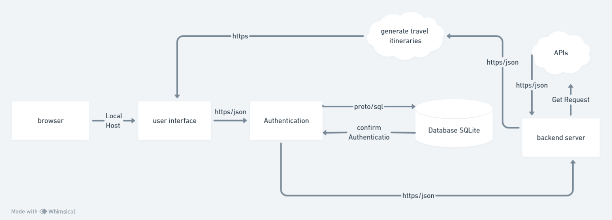
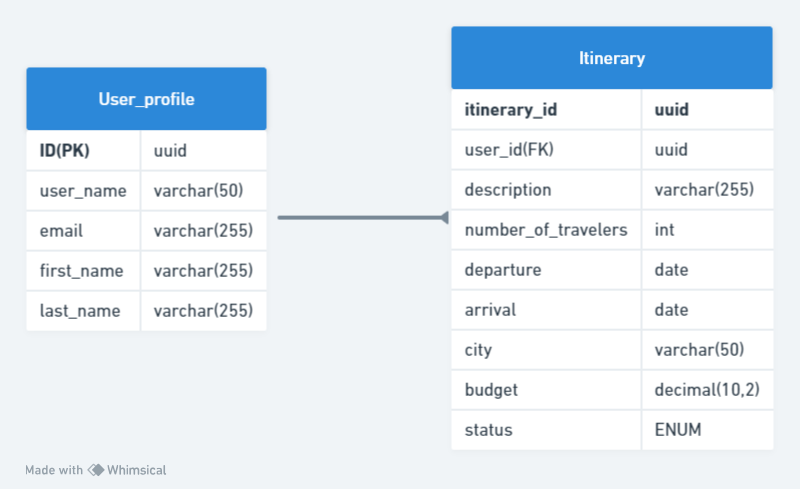
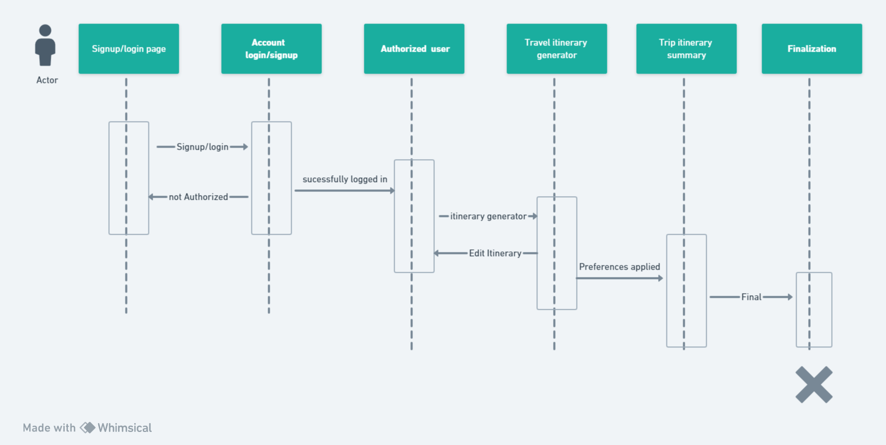

# NAwayfarer Architecture

## 1) High-level Component Diagram

The starting point for the user's interaction with the NAwayfarer application. Through the browser, users access the travel itinerary platform. User Interface Acts as the conduit through which users engage with the application. This includes pages for signing up, logging in, entering itinerary details, and viewing travel plans. The interface is designed to send and receive information in JSON format. 
Authentication A critical security feature that manages user accounts. When a user attempts to sign up or sign in, the authentication component processes their credentials, communicates with the database to verify them. For account creation, user details are securely transmitted to the database for storage. The database is securely stores user profiles, itinerary details, and other relevant data. It is accessed via SQL protocols for all data retrieval and storage operations.  
Backend Server: This is the central hub of the NAwayfarer application, orchestrating the flow of data between the user interface, the database, and external APIs. It processes user inputs, fetches data from external services, and performs the logic required to generate travel itineraries.
The application using APIs like Yelp for business and location reviews and Kiwi for flight information. These APIs are accessed by the backend server through HTTPS/JSON, and GET requests are utilized to retrieve the necessary data to enrich travel plans.
Itinerary Generator takes the information from external APIs and user inputs to create travel itineraries and presented to the user.

## 2) Entity Relationship (ER) Diagram

The ERD consists of two entities, User_profile and Itinerary, which represent the data for users and their travel plans.
User_profile has attributes to store the user's unique ID, username, email, and names.
Itinerary holds travel details, linked to User_profile via a foreign key to the user's ID, and includes information such as itinerary ID, travel dates, city, number of travelers, budget, and travel status.
The relationship is one-to-many, each user can have multiple itineraries but each itinerary is associated with a single user. This setup allows for the organization and retrieval of travel plans by user within a database system.
## 3) Flow Diagram 

The flowchart outlines a user's navigation through a trip planning process in an application. It begins with the user on the "Signup/login page." If the user fails to authenticate, the flow repeats until successful login occurs. Once logged in, the user is considered "Authorized" and moves on to the "Travel itinerary generator," where they create an initial travel plan. The user has the option to "Edit itinerary," suggesting that they can make changes to their plan. After editing, the system applies the user's preferences, which leads to a "Trip itinerary summary." The process concludes with the "Finalization" step, where the user finalizes their travel plans
