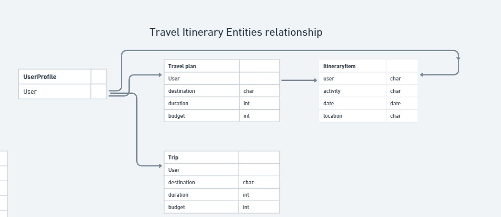
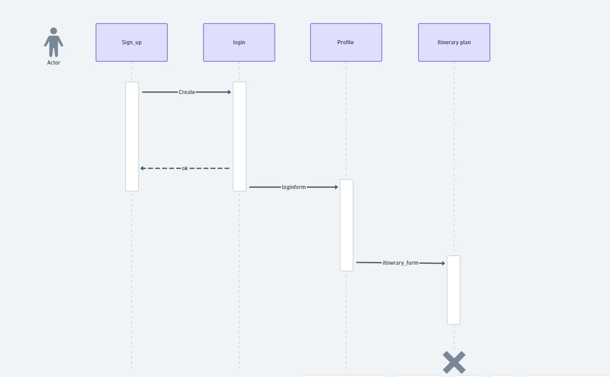

# Travel-Itinerary Architecture 

The system architecture is composed of distinct components that collaborate to ensure its functionality. The front-end layer is the website-client component, it allows users to navigate to other pages The web server can be loggin and register as a new users and its user login data will then be saved to a database DB. The filter form component allows user to enter their filter conditions and then output Itineray plans based on the filters, then the filter form input data will be also saved to the database DB. 

# Relationship diagram

The Relationship between the entities is that the UserProfile has attribute 'user'. Each user has their own 'travel plan' Entities connected by the foreign key 'user' and has attributes 'user' for specific user, 'destination' for each destination location, 'duration' for the amount of time and 'budget' for budget of each travel plan. and 'Travel plan's can turn into trips into 'ItineraryItem' entity connected by foreign key 'user', 'ItineraryItem' stores 'user' for corresponding user, 'activity' for suggested activity to do, 'date' for dates, and 'location' for where to go in the plan. Each 'userProfile' also has their past trips entities 'trip' connected by foreign key attribute 'user, and has attributes 'user' for specific user, 'destination' for each destination location, 'duration' for the amount of time and 'budget' for budget of each travel plan.

# Flow Diagram

The flow diagram demonstrates how a person can sign up to create an account, be able to login afterward, then use the login form to go into their account, and be able to create their itinerary plan using the itinerary form to start planning their trips 
