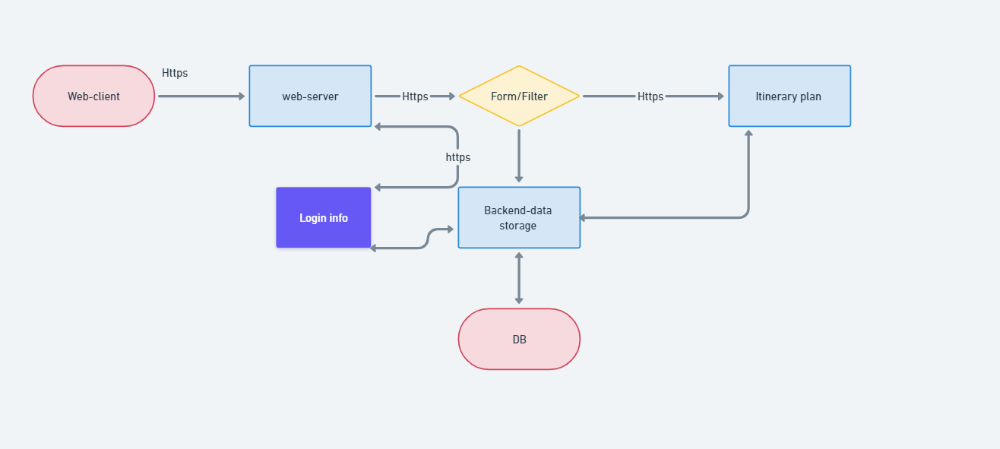

The system architecture is composed of distinct components that collaborate to ensure its functionality. The front-end layer is the website-client component, it allows users to navigate to other pages of functions. The web server can be loggin and register as a new users and its user login data will then be saved to a database DB. The filter form component allows user to enter their filter conditions and then output Itineray plans based on the filters, then the filter form input data will be also saved to the database DB. 

