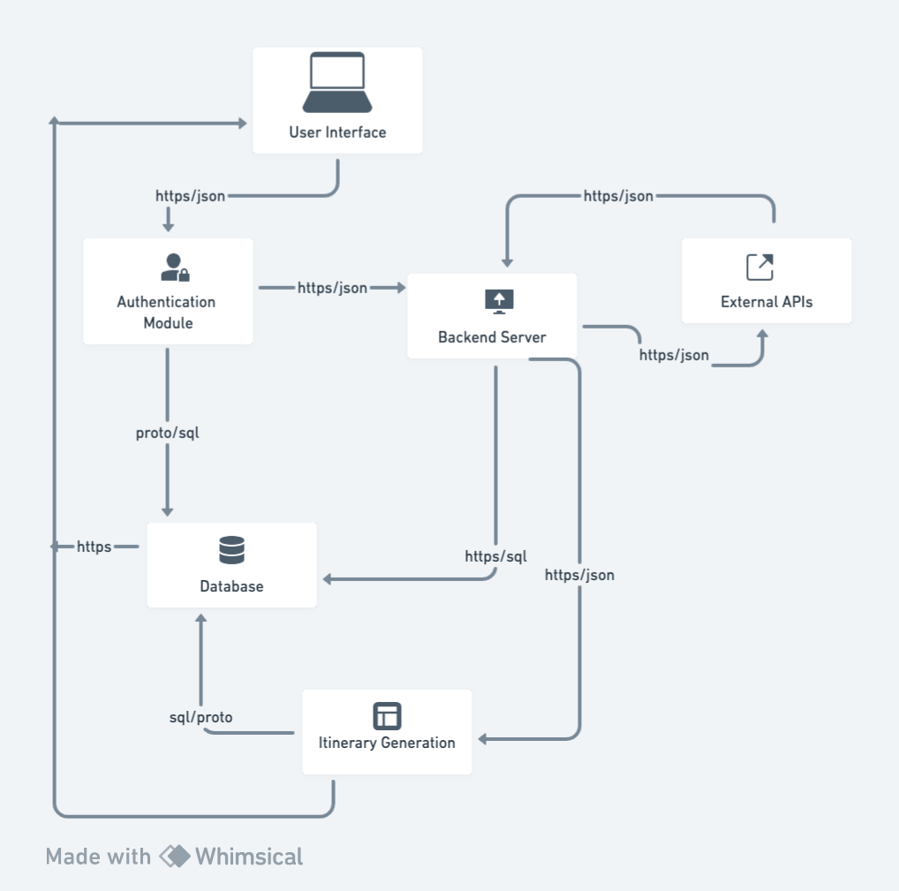

# Travel Itinerary Project

## 1) Component Diagram

Our web-based travel itinerary application's system architecture is structured to deliver a seamless user experience. Here's a breakdown of how the key components interact with each other:

- **User Interface (UI):** The journey begins with the User Interface, where users can sign up or log in. Once authenticated, users input their itinerary data via the UI.

- **Authentication:** The Authentication component verifies user identities and plays a pivotal role in ensuring secure access to the system. During signup, it sends user data to the Database for account creation.

- **Backend Server:** Acting as the central hub, the Backend Server receives user-entered itinerary data from the UI. It then communicates with External APIs to obtain real-time flight and hotel information. The fetched data is relayed back to the Backend Server for processing.

- **External APIs:** These external services provide up-to-date flight and hotel information. The Backend Server sends requests to these APIs, which respond with valuable data in return.

- **Database:** Our database serves as the repository for user profiles, itinerary details, and other essential data. The Authentication component stores user data during signup, while the Backend Server writes and retrieves data for the itinerary generation process.

- **Itinerary Generation:** This component processes the retrieved data to create personalized travel itineraries, ensuring users receive tailored travel plans. The generated itineraries are then stored in the Database.

- **User Profile:** User Profile management involves the storage and retrieval of user information and itineraries. When users want to view their saved itineraries, the User Profile component retrieves the data from the Database and presents it to the User Interface.

In summary, our application's architecture orchestrates a coordinated flow of information. The User Interface initiates the user journey, Authentication ensures security, the Backend Server manages data transfer and processing, External APIs provide real-time information, and the Database acts as the repository. Itinerary Generation tailors itineraries, and User Profile delivers user-specific data to the UI. This collaborative interaction results in a comprehensive and personalized travel planning experience for our users.