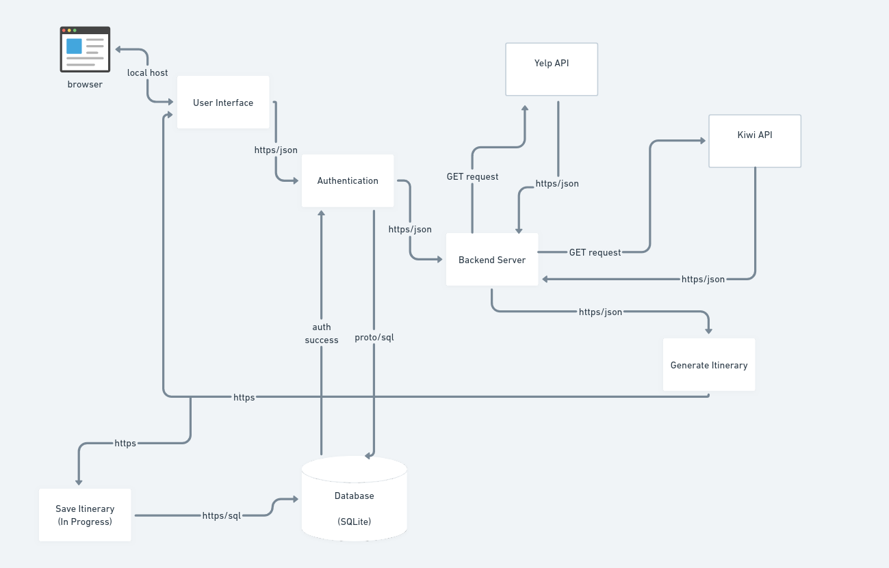
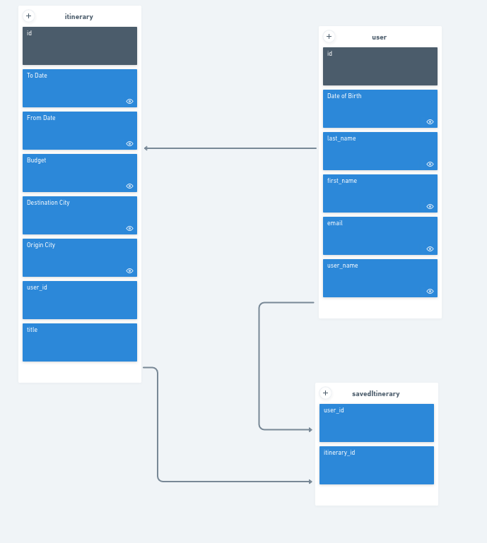
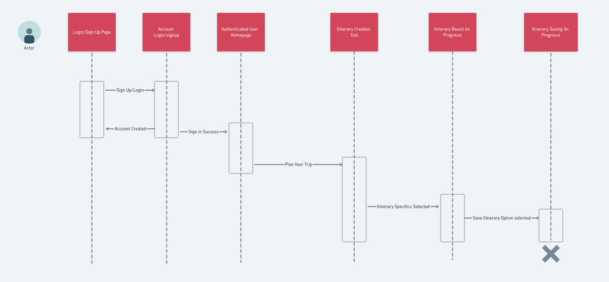

# High-Level Component Diagram

This is the High-Level Component Diagram for my team's application, NAwayfarer. This diagram is tentative and subject to change as we are still in the development phase.

Here is a breakdown of this diagram:
The user begins by navigating the browser to the web application. In our case, we are still running the application locally; thus, this is not a public-facing application just yet (I am currently working on deploying to EC2). The user uses the browser as the interface and a means of communication with the application.

To use the application, the user must authenticate via login or signup. The application allows the user to log in or sign up using the built-in authentication Django provides. The authentication module has to make calls to the database to check the inputted credentials in the case of a login, or to save the inputted credentials, in the case of a sign up.

The user can then input their desired information regarding the itinerary. In the backend, calls are made to the Yelp API and Kiwi API. The information gathered is then sent to a method to generate the itinerary. Itinerary generation is still in the works, but we are planning to use Open API for this.

The generated itinerary is then returned to the user. The user will have the option to save the itinerary. This is also in the works.

# Entity Relationship Diagram

This is the Entity Relationship Diagram for NAwayfarer.

Here is a simple breakdown:
The Itinerary entity stores the itinerary and holds most of the information inputted during its generation. Additionally, we are still deciding on saving a couple more details, such as the date of creation, and adding a description for the itinerary. It connects to the user via the user_id.

The Saved Itinerary entity contains the saved itineraries for a user. It maps to the user via the user_id and connects to the saved itineraries via an array of the saved itinerary_id(s).

Finally, we have the User entity. The User entity saves basic information about the user, such as their first and last name, date of birth, email, and potentially more.

# Flow Diagram

This is the flow diagram for the NAwayfarer application. It illustrates the 'flow' of the application as the user experiences it.

To use the application, the user must authenticate. If an account is created, the user is redirected to the unauthorized homepage, where they must log in. Upon logging in, the user navigates to the 'Plan Your Trip' page. There, they input the information for the itinerary and click 'Generate Itinerary.' The itinerary is then displayed, and the user has the option to save it. This concludes the user's flow.